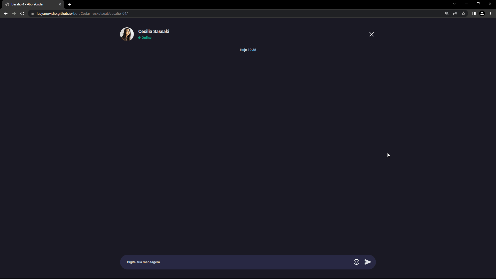

# Desafio 4 - Chat ✅

[🚀 Acesse aqui](https://lucyanovidio.github.io/boraCodar-rocketseat/desafio-04/) | [🔗 Post no LinkedIn](https://www.linkedin.com/posts/lucyanovidio_boracodar-html-css-activity-7027053363980570624-Ftj_?utm_source=share&utm_medium=member_desktop)

## 💻 O desafio

O desafio 4 é uma página responsiva simulando um chat entre duas pessoas. 

Usei um pouco da convenção BEM para CSS que tenho estudado - que ajuda muito com a leitura de elementos pais e filhos, estados e a evitar acidentes de aplicações erradas de propriedades - para aplicar em projetos maiores futuramente. 

E além do layout, implementei algumas ideias:
* Aba lateral de informações do usuário
* Você pode enviar mensagens
* Você pode excluir suas mensagens
* Horário atual da mensagem na hora que é enviada
* Emojis com a lib <a href="https://emoji-button.js.org">Emoji Button</a>
* Suas mensagens são respondidas na conversa, de forma aleatória, mas com base no que você envia! 😆

## 🎨 Layout do projeto

Este é o <a href="https://www.figma.com/file/8UMgBXJ4ra2EQ20XOt1hsW/%23boraCodar---Desafio-4-(Community)?node-id=0%3A1&t=wuX2q8EITvBWU8X0-0">layout do projeto</a> no Figma.

## 🛠 Tecnologias

    
    
    

 

***#boraCodar***
 

---

<table>
  <tr>
    <td>
      
    </td>
    <td>
      Feito por <a href="https://github.com/lucyanovidio">Lucyan Ovídio.</a> 🙋🏿‍♂️
    </td>
  </tr>
</table>
