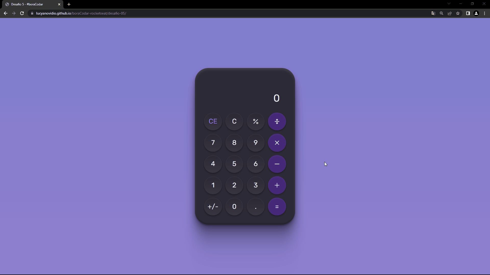

# Desafio 5 - Calculadora ✅

[🚀 Acesse aqui](https://lucyanovidio.github.io/boraCodar-rocketseat/desafio-05/) | [🔗 Post no LinkedIn](https://www.linkedin.com/posts/lucyanovidio_boracodar-21diasdecodigo-javascript-activity-7028924838048083968-M0lN?utm_source=share&utm_medium=member_desktop)

## 💻 O desafio

O desafio 5 é um layout de uma calculadora. 

Construí o layout e tornei ela funcional buscando o máximo de semelhança com a calculadora do computador. Além das funcionalidades comuns de uma calculadora, queimei bastante a cabeça também para implementar outras ideias:
* Funcionalidade de troca de sinal positivo para negativo e vice-versa
* Digitação pelo teclado também
* Responsividade

## 🎨 Layout do projeto

Este é o <a href="https://www.figma.com/community/file/1202607074523509182">layout do projeto</a> no Figma.

## 🛠 Tecnologias

    
    
    

 

***#boraCodar***
 

---

<table>
  <tr>
    <td>
      
    </td>
    <td>
      Feito por <a href="https://github.com/lucyanovidio">Lucyan Ovídio.</a> 🙋🏿‍♂️
    </td>
  </tr>
</table>
