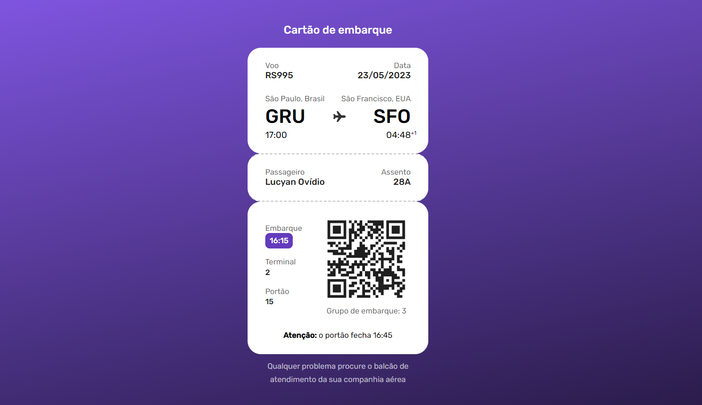

# Desafio 6 - Cartão de embarque ✅

[🚀 Acesse aqui](https://lucyanovidio.github.io/boraCodar-rocketseat/desafio-06/)

## 💻 O desafio

O desafio 6 é um layout de um cartão de embarque fictício para uma viagem.

## 🎨 Layout do projeto

Este é o <a href="https://www.figma.com/community/file/1205146101173113980">layout do projeto</a> no Figma.

## 🛠 Tecnologias

    
    

 

***#boraCodar***
 

---

<table>
  <tr>
    <td>
      
    </td>
    <td>
      Feito por <a href="https://github.com/lucyanovidio">Lucyan Ovídio.</a> 🙋🏿‍♂️
    </td>
  </tr>
</table>
