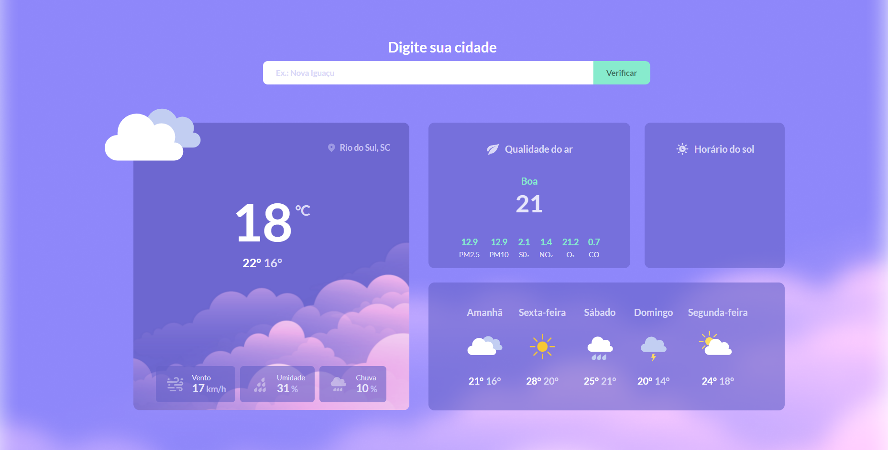

# Desafio 10 - Página de clima

> Incompleto

[🚀 Acesse aqui](https://lucyanovidio.github.io/boraCodar-rocketseat/desafio-10/)

## 💻 O desafio

O desafio 10 é uma página de clima mostrando qualidade do ar, horário do sol, e a previsão do tempo ao longo da semana.

## 🎨 Layout do projeto

Este é o <a href="https://www.figma.com/file/6cSzS3kLdCVK1vML6VfNzQ/%23boraCodar---Desafio-10-(Community)?node-id=328%3A2&t=a1HD6ZDtz3v84nJ0-0">layout do projeto</a> no Figma.

## 🛠 Tecnologias

    
    
    

 

***#boraCodar***
 

---

<table>
  <tr>
    <td>
      
    </td>
    <td>
      Feito por <a href="https://github.com/lucyanovidio">Lucyan Ovídio.</a> 🙋🏿‍♂️
    </td>
  </tr>
</table>
